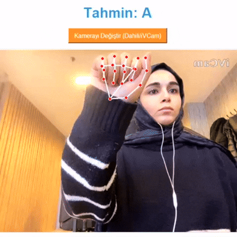

# 🖐️ Sign Language Recognition System



This application is an advanced technological solution that integrates MediaPipe Hands and Deep Learning to recognize hand gestures (25 letters from A-Z, excluding J) in real-time with high accuracy. By leveraging sophisticated computer vision techniques and camera-based motion tracking, it translates hand movements into letters, providing a seamless and interactive user experience.

---

## 🛠️ Technology Stack & Libraries

- **Core Logic:** Python 3.11
- **Computer Vision:** [MediaPipe](https://mediapipe.dev/) (Hand Landmark Detection)
- **Deep Learning:** [TensorFlow 2.17 / Keras 3](https://tensorflow.org/) (Neural Network)
- **Image Processing:** OpenCV
- **GUI:** Tkinter & PIL (Pillow)
- **Data Analysis:** NumPy, Matplotlib, Scikit-learn

## 📐 System Architecture

The project follows a modular pipeline from data acquisition to real-time inference:

### 1. Data Collection
Instead of raw images, the system captures **63 physical coordinates** (21 points × X, Y, Z) of the hand. This makes the model extremely lightweight (~700KB) and robust against lighting/background changes.

### 2. Dataset Preparation
Accumulated `.npy` files are aggregated into a single vectorized dataset (`X_dataset.npy` and `y_labels.npy`).

### 3. Model Training
A Deep Neural Network (DNN) with the following architecture:
- **Input Layer:** 63 features
- **Hidden Layers:** 256 -> 128 -> 64 with **Dropout** (0.4, 0.3, 0.2) to prevent overfitting.
- **Output Layer:** 25 classes with **Softmax** activation.
- **Optimizer:** Adam
- **Loss Function:** Sparse Categorical Crossentropy

### 4. Evaluation
Detailed performance metrics including a **Classification Report** and **Confusion Matrix** to identify specifically which letters are being confused.

---

## 🚀 Getting Started

### 1. Prerequisites
Ensure you have Python 3.11 installed.

### 2. Installation
Install all dependencies using:
```bash
py -3.11 -m pip install -r requirements.txt
```

### 3. Running the App
The easiest way is to use the provided command file:
- Simply double-click **`start_app.cmd`**
- Or run in terminal: `py -3.11 gui_inference.py`

---

## 🎯 Fine-Tuning & Customization
To teach the system new signs:
1. Run `data_collector.py` to record at least 500 samples per sign.
2. Run `prepare_dataset.py` to rebuild the matrix.
3. Run `train_model.py` to update the `.keras` model file.
